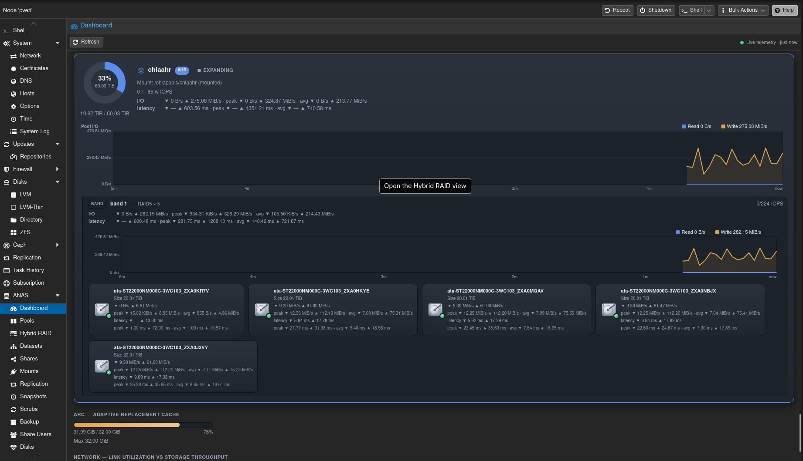
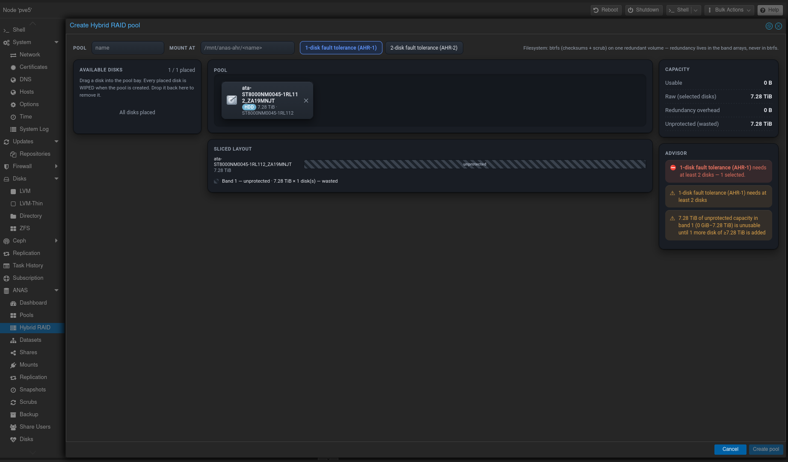
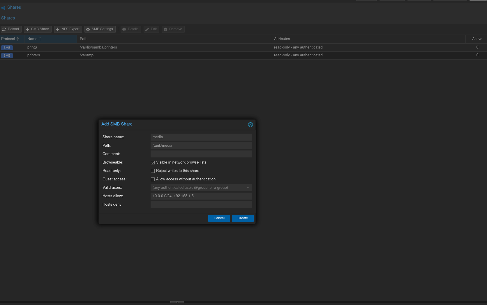
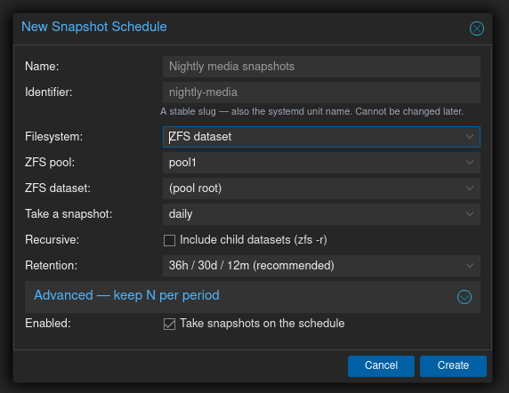

# ANAS — A NAS

**TrueNAS-style storage management for Proxmox VE, inside the Proxmox web UI.**

ANAS adds the storage management layer that Proxmox's native UI doesn't cover:
ZFS pools, datasets, snapshots and replication, SMB/NFS shares, share security,
file backup to PBS, and **Hybrid RAID pools that mix drive sizes and grow one
disk at a time** — presented as native panels injected into the PVE web UI
itself (the same model Proxmox uses for Ceph). There is no separate web app to
visit and no separate login: you use your existing PVE session.

Think TrueNAS, but purpose-built to **complement** Proxmox rather than replace it.

> **Status: pre-1.0.** Actively developed and dogfooded on a production PVE
> cluster, but interfaces and behavior may change without notice. Use at your
> own risk — and read the guest philosophy below for why the risk is smaller
> than you'd think.

## Screenshots



**Live dashboard** — pool health, capacity, and real-time per-pool and per-disk I/O + latency, for ZFS and AHR pools alike. Caught here with an AHR array expanding online, one disk at a time.



**Hybrid RAID (AHR)** — build a redundant pool from mixed-size disks by dragging them in, with a live sliced layout and honest capacity accounting. The advisor won't let you footgun it — here it flags that a single disk has no redundancy, and exactly what's needed to fix it, rather than silently building something unsafe.



**SMB & NFS shares** — create and secure shares with per-share access control: valid users, browseable, read-only, and allowed/denied hosts.



**Scheduled snapshots & scrubs** — uniform snapshot schedules across ZFS and AHR, driven by systemd timers with keep-N-per-period retention and sane presets built in.

## Features

- **Dashboard** — pool health, capacity, fleet disk health, shares, running
  jobs, warnings, and live telemetry (ARC, network throughput, per-pool/disk
  I/O with latency for both ZFS and AHR pools — the AHR strip breaks down to
  per-band and per-member throughput/IOPS/latency)
- **ZFS pools** — create/import/export/destroy, scrub, topology view with
  per-bay disk health, device errors, properties; a drag-to-build vdev
  composer with a live capacity/redundancy preview and a rules-based pool
  advisor
- **Hybrid RAID (AHR)** — Synology-SHR-style pools from **mismatched disk
  sizes**, using every drive's full height (a 12 TB next to 8 TBs contributes
  all 12, not 8): disks are sliced into size-matched bands, each band is its
  own md RAID5/6 array, LVM concatenates them under one btrfs filesystem
  (checksums + scrub; redundancy always lives in md, never btrfs-RAID).
  **Grow-as-you-buy online expansion** — add or live-replace one disk at a
  time while the pool stays mounted; a live layout preview shows exactly what
  each disk combination yields (and names any capacity that stays locked
  until a matching disk arrives) before you commit. Expansion is a resumable
  multi-layer job: power loss mid-reshape is survivable, interrupted runs
  resume or abandon cleanly, and md events land in PVE's own notification
  system. **Hot spares** — full-coverage spares sliced into every band so md
  owns automatic failover; expansion auto-extends spare coverage to new bands.
  **btrfs snapshots** — new pools get an `@data`/`@snapshots` subvolume layout;
  list/create/delete and roll back, with rollback preserving the replaced state
  (destroying nothing)
- **Datasets** — create/manage, quotas, compression, permissions/ACLs, a
  layered access editor
- **Snapshots** — create, rollback (gated), clone, destroy
- **Replication** — `zfs send/recv` tasks on systemd timers: local pool→pool
  and remote over SSH (PVE cluster peers auto-discovered; external hosts —
  including TrueNAS — need only sshd + ZFS, nothing installed)
- **SMB shares** — full share lifecycle over a round-trip `smb.conf` editor
  that preserves your comments and formatting; connection details view
- **NFS exports** — same treatment for `/etc/exports`
- **Share users/groups** — Samba user management for share access (no
  role/permission system — PVE owns identity)
- **Mounts** — client-side NFS/CIFS mounts with surgical fstab persistence
  (credentials in root-only files, never on a command line), a common option
  set across both protocols and human-readable file/dir permission modes;
  local and PVE-owned mounts inventoried read-only
- **File backup (PBS)** — back up shares, datasets, or any mounted path to a
  Proxmox Backup Server with `proxmox-backup-client` (dedup, encryption,
  retention), ZFS-snapshot-consistent where the source supports it
- **Disk health** — SMART + ZFS fused per-disk status

## How it's built (the guest philosophy)

ANAS treats your system as the source of truth and itself as a **guest**:

- **No shadow state.** Nothing is stored that the system doesn't already know.
  Pools come from `zpool`, shares from `smb.conf`/`exports`, schedules from
  systemd units. Uninstalling ANAS loses nothing.
- **Surgical config editing.** Config files are edited in place — comments,
  ordering, and hand-edits preserved byte-for-byte outside the touched lines.
  Never overwritten, never "owned".
- **Leverage, don't rebuild.** PVE's certificates, auth tickets, journald,
  systemd timers, and cluster filesystem are used as-is. ANAS builds no
  scheduler, no notification system, no user database.
- **Two processes, one boundary.** An API gateway (`anas`, plain HTTP on the
  loopback interface) fronts a system daemon (`anasd`, REST over a Unix socket).
  The gateway is reached through PVE's own `:8006` front door under `/anas`
  (a fail-open reverse-proxy hook in pveproxy) — no separate origin, no extra
  certificate. All mutations are queued jobs; every operation is audited to
  journald with the requesting user's identity.
- **Dangerous operations are gated.** Destructive actions require an explicit
  confirmation code round-trip — no accidental pool destroys.

## Requirements

- Proxmox VE node (single node or cluster)
- Node.js ≥ 20 (installer can provide via `--install-deps`)
- ZFS ≥ 2.2 (ANAS uses `zpool`'s JSON output)
- `mdadm` + `btrfs-progs` for Hybrid RAID (the installer adds them — PVE
  doesn't ship either)
- Optional per-protocol: `samba` (SMB), `nfs-kernel-server` (NFS)

## Install

Grab a release tarball, untar it on the PVE node, and run the installer as
root:

```sh
tar xzf anas-<version>.tar.gz
cd anas-<version>
sudo ./install.sh              # add --install-deps on a fresh node
```

The installer preflights the node without touching it, then performs a
transactional install (backup → install → health check → PVE UI integration)
that rolls itself back completely on any failure. Re-running it is the upgrade
path. ANAS is served through pveproxy on `:8006` under `/anas`, so there is no
separate origin and **no extra certificate to accept** — if the Proxmox web UI
loads, ANAS does. See [`packaging/README.md`](packaging/README.md) for flags
and uninstall.

## Building from source

```sh
npm install
./packaging/make-release.sh    # builds, smoke-tests, and tars a release
```

Produces `dist-release/anas-<version>.tar.gz`. Versioning is semver with a
single source of truth — see [`packaging/README.md`](packaging/README.md).

## Development

```sh
npm install
npm run dev     # anasd in mock mode (no real ZFS needed) + gateway with dev auth
```

See [`CONTRIBUTING.md`](CONTRIBUTING.md) for the workflow, tests (unit +
Playwright against a disposable "stunt" PVE node), and project structure, and
`docs/` for the architecture ([`DESIGN.md`](docs/DESIGN.md)), the
non-negotiable design principles ([`PRINCIPLES.md`](docs/PRINCIPLES.md)), and
the story backlog ([`EPICS.md`](docs/EPICS.md)).

## License

ANAS is free software, licensed under the **GNU Affero General Public License
v3.0 or later** (AGPL-3.0-or-later) — the same license family as Proxmox VE
itself. See [`LICENSE`](LICENSE).

Copyright © 2026 Chris Cebelenski
